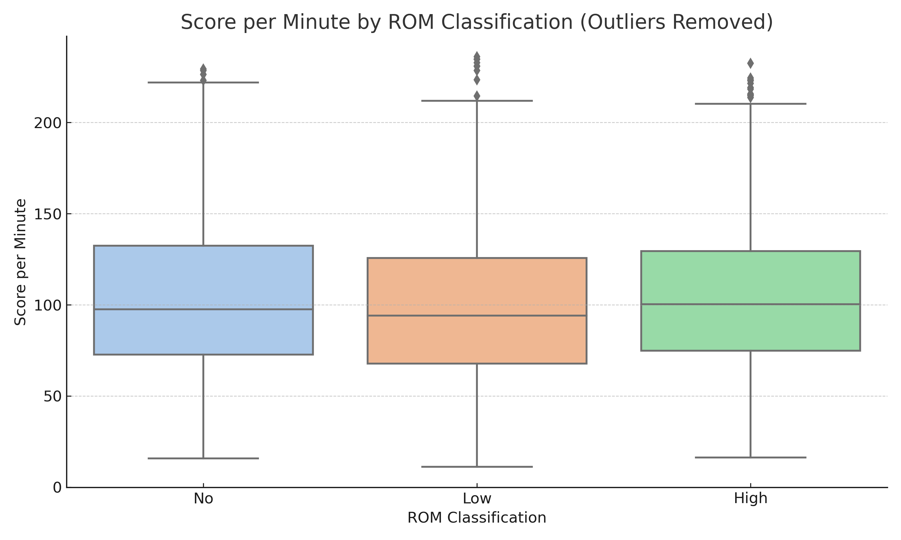
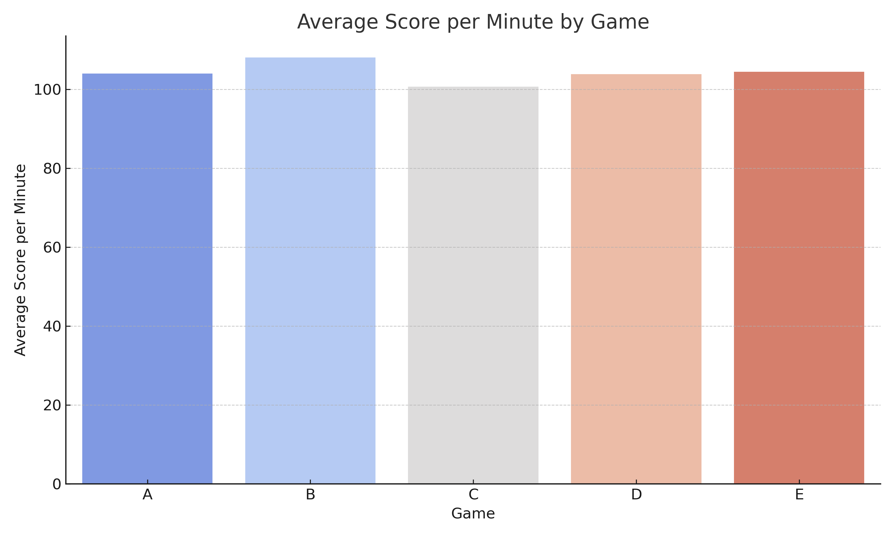
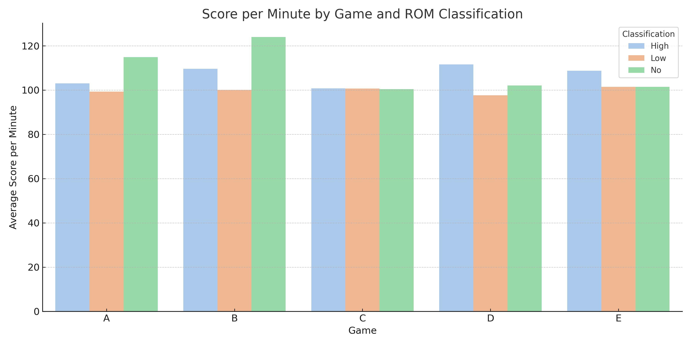

# Analyzing Score Efficiency in Therapeutic Games for Rehabilitation (Mock Data)

This project simulates and analyzes patient performance data from therapeutic game-based rehabilitation sessions. It focuses on time-normalized scoring efficiency, patient classification based on mobility, and game difficulty. The goal is to illustrate how data-driven insights can be used to understand and improve rehabilitation outcomes.

**Note:** This project uses mock data to demonstrate the approach. No real patient information is included.

## What Is Measured?

- **Score per Minute**: A normalized performance metric defined as `score / game_duration`, which helps compare efficiency regardless of session length.
- **Patient Classification**: Patients are categorized into High, Low, or No mobility groups based on their range of motion (ROM).
- **Game Difficulty**: Each game is mapped to a difficulty level (easy to hard) using a lookup table.

## Project Features

- Time-normalized scoring analysis using `score_per_minute`
- Outlier filtering with Interquartile Range (IQR)
- Performance comparisons across patient mobility levels
- Game-type and difficulty analysis
- Use of colormaps in visualizations for intuitive trends

## File Structure

```
rom-score-efficiency-analysis/
├── data/                   # contains mock_rom_data.csv
├── notebooks/              # contains ROM_Score_Efficiency_Insights.ipynb
├── figures/                # for output plots
├── src/                    # optional helper code
├── README.md
├── requirements.txt
```

## How to Use

1. Clone this repository:
   ```bash
   git clone https://github.com/yourusername/rehab-performance-efficiency-analysis.git
   ```
2. Install dependencies:
   ```bash
   pip install -r requirements.txt
   ```
3. Open the notebook:
   ```bash
   jupyter notebook notebooks/ROM_Score_Efficiency_Insights.ipynb
   ```
## Sample Output

**Score per Minute by ROM Classification (after IQR filtering):**  


**Average Score per Minute by Game Type:**  


**ROM Classification vs Game Type Efficiency:**  


This project demonstrates how combining basic statistical filtering, domain knowledge, and visual storytelling can uncover meaningful trends in therapeutic game data — even when starting with mock data.

